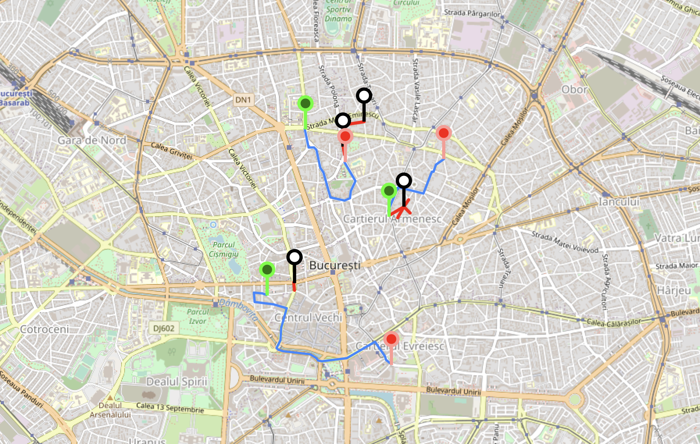

# HackA-Map 🗺️

Made for InfoEducație, because I wanted to understand the challenge that they got at the Open, Section WebDev.



## Installation

```bash
pip install -r requirements.txt
npm install
```

## Requirements
Enable CORS in your browser because the server runs on your machine

## Start-up
Start the back-end:
```bash
python app.py
```
Start the front-end:
```bash
npm run build | npm run start
```


